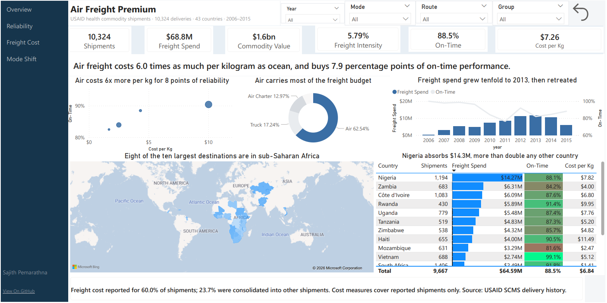
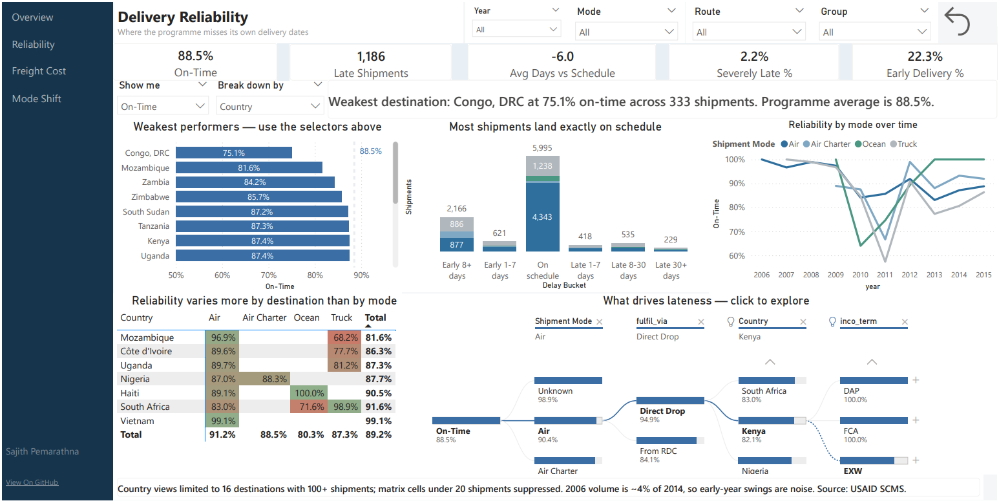
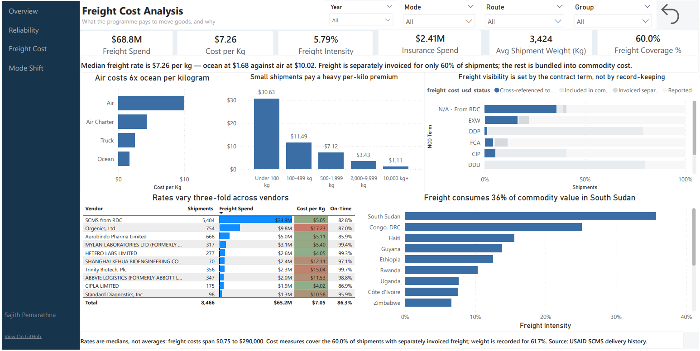
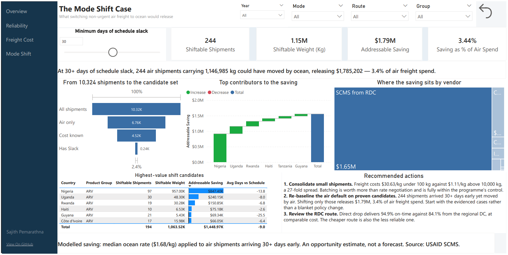

# Air Freight Premium

Power BI analysis of USAID health commodity shipments: 10,324 deliveries to 43
countries between 2006 and 2015, carrying $1.6bn of commodity value on $68.8M
of freight.

**The question:** air takes 62.5% of the freight budget, and air charter
another 13%. How much of that premium actually buys faster, more reliable
delivery?

Four pages, each answering one question.

**[Watch the walkthrough](https://drive.google.com/file/d/1nnocS0NYqQ7si1tNtoc1A_ZzLU7SWCzr/view?usp=sharing)** ·
[Full dashboard as PDF](docs/air-freight-premium-dashboard.pdf)

---

## 1. What are we paying for speed?



**Air freight costs 6.0 times as much per kilogram as ocean, and buys 7.9
percentage points of on-time performance.**

The scatter carries the whole argument. Ocean sits bottom left, cheap and
slightly less reliable. Air sits far right, expensive and only marginally
better. Programme-wide on-time delivery is 88.5% at a median rate of $7.26 per
kilogram, and freight runs at 5.79% of commodity value.

Spend is heavily concentrated. Nigeria alone absorbs $14.27M across 1,194
shipments, more than double any other destination, and eight of the ten largest
destinations are in sub-Saharan Africa.

---

## 2. Where does reliability actually break?



Destination matters more than mode. Shipment modes span 80.3% to 91.2%
on-time. Destinations span 75.1% to above 94%, with Congo DRC weakest at 75.1%
across 333 shipments against a programme average of 88.5%.

The sharper finding is routing. **Among air shipments, direct drop delivers
94.9% on-time while shipments routed through the regional distribution centre
deliver 84.1%**, at comparable cost per kilogram. The cheaper route is also the
less reliable one, and it handles 5,404 of the 10,324 shipments.

1,186 shipments arrive late, 2.2% of them more than 30 days late. But the
distribution is not only about lateness: 2,166 shipments arrive more than eight
days **early**, and 22.3% arrive more than a week early. Stock landing well
ahead of need is warehouse cost, not service.

---

## 3. What drives what we pay?



**Small shipments pay a 27-fold premium.** Under 100 kg costs $30.63 per
kilogram. Above 10,000 kg costs $1.11. Consolidation is worth more than any
rate negotiation, and it sits entirely inside the programme's control.

Vendor rates run from $4.02 to $17.23 per kilogram at comparable volumes, and
rate does not predict reliability. One vendor delivers 99.4% on-time at
$5.40/kg while the RDC route delivers 82.8% at $5.05/kg. Paying more does not
buy performance here.

Freight is separately invoiced on only 60.0% of shipments. That gap is not a
record-keeping failure, it is a contract structure: the INCO term decides
whether freight is billed separately, bundled into commodity cost, or
cross-referenced to another shipment.

Freight intensity also varies sharply by destination, reaching 36% of commodity
value in South Sudan against 5.79% programme-wide.

---

## 4. What would changing it be worth?



**244 air shipments arrived more than 30 days ahead of schedule.** Those were
never time-critical. Moving them to ocean releases **$1.79M**, 3.4% of air
freight spend, without touching a single delivery date that mattered.

The funnel shows the narrowing honestly rather than hiding it: 10,324
shipments, 6,760 by air or charter, 4,520 with both cost and weight recorded,
240 with 30+ days of schedule slack. That is 2.4% of the programme.

A slider lets the reader change the slack threshold and watch the estimate
resize. Nigeria alone accounts for $847K of the total, and the RDC route for
$1.65M of it.

**Recommended actions**

1. **Consolidate small shipments.** The 27-fold per-kilo spread is the largest
   controllable cost lever in the data.
2. **Re-baseline the air default on proven candidates.** Start with the 244
   evidenced cases, not a blanket policy change.
3. **Review the RDC route.** Around eleven points of on-time performance at no
   cost saving, across more than half the programme's shipments.

---

## How it is built

```
SCMS delivery history CSV
   -> profile_usaid.py   profile the source before modelling
   -> prep.py            clean, classify missing values, build star schema
   -> parquet            fact_shipment + 6 dimensions
   -> Power BI           DAX measures, 4 report pages
```

**Model:** star schema with a single fact table and six dimensions, all
relationships single-direction from dimension to fact, date table marked.

### Measurement choices

Most of the analytical work here is in deciding what a number should mean, not
in building the visual.

**Median cost per kilogram, not mean.** Individual freight costs span $0.75 to
$290,000. An average would be dominated by a handful of charter shipments and
would describe nothing typical.

**Row-set matched ratios.** Cost per kilogram divides freight by weight only
across rows where both values were reported. Dividing total freight by total
weight when the two are recorded on different subsets inflates the rate, and
the error survives review because the result still looks plausible.

**Suppressed cells.** Matrix values built on fewer than 20 shipments are
blanked rather than displayed. Without this, a lane with three shipments and no
late deliveries shows as a 100% performer and gets coloured as the best in the
report.

**Volume floors.** Country breakdowns require 100+ shipments, which leaves 16
of the 43 destinations. A country with six shipments can otherwise top or
bottom any ranking on chance alone.

**Missing values classified, not dropped.** Freight cost is absent for 40% of
rows, but for three distinct reasons: bundled into commodity cost, invoiced
separately, or cross-referenced to another shipment. Each is recorded as a
status rather than treated as a null, which is what makes the INCO term finding
on page 3 visible at all.

### Interactivity

Field parameters let the reader switch both the dimension and the metric on
page 2, so one chart covers thirty combinations. A decomposition tree drives
root cause exploration. A what-if parameter on page 4 resizes the savings model
live. Plus sidebar navigation, slicers synced across all four pages, and a
filter reset.

---

## Assumptions and limits

- Savings on the Mode Shift page are **modelled, not realised**. The estimate
  applies the median ocean rate to air shipments that arrived with schedule
  slack, and assumes that slack would have absorbed the longer transit and that
  ocean rates hold at higher volume. It sizes an opportunity, not a forecast.
- Cost measures cover the 60.0% of shipments with separately invoiced freight.
  Weight is recorded on 61.7%. A further 23.7% were consolidated into other
  shipments' documentation.
- 2006 carries roughly 4% of 2014's volume, so early-year comparisons are
  volume-sensitive.
- Shipments with no recorded mode are excluded from mode breakdowns.

---

## Files

| Path | What it is |
|---|---|
| `src/profile_usaid.py` | Profiling the source data before modelling |
| `src/prep.py` | Cleaning and star schema build |
| `data/raw/` | Source CSV |
| `data/curated/` | Parquet model files |
| `pbix/` | Power BI file |
| `docs/` | PDF export and page screenshots |

## Reproducing it

```bash
pip install pandas pyarrow
python src/prep.py
```

Then open the .pbix in `pbix/` and refresh.

## Data source

SCMS Delivery History, published by USAID.

---

Built by Sajith Pemarathna, data analyst in Berlin.
[LinkedIn](https://www.linkedin.com/in/sajith-pemarathna/)
